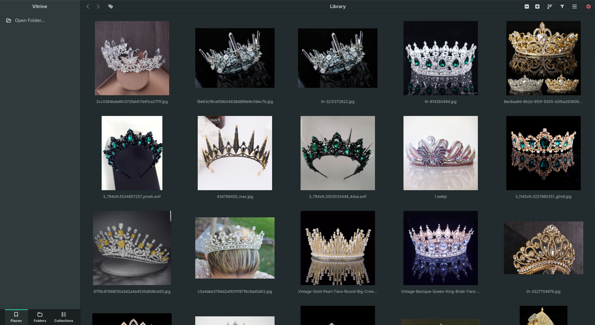
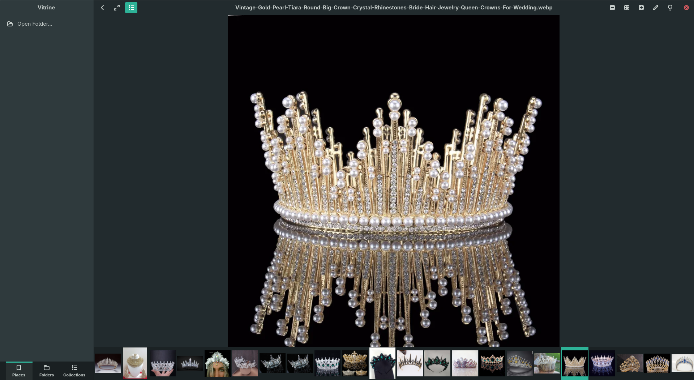
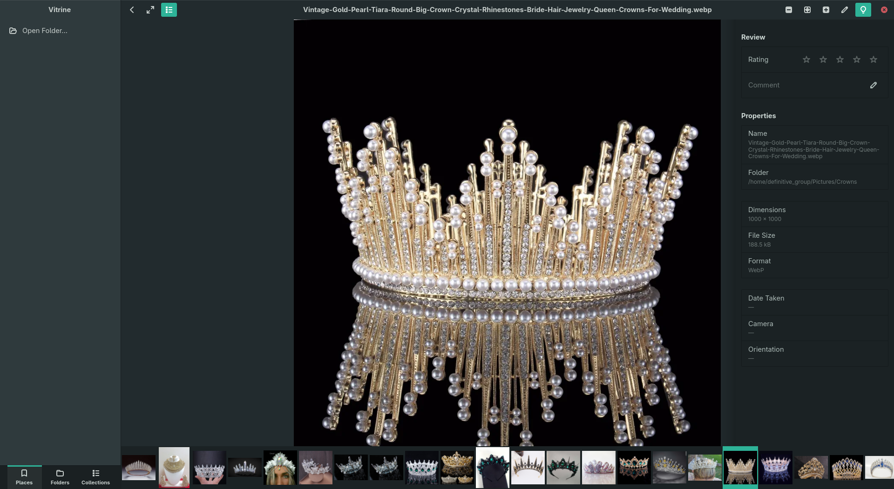
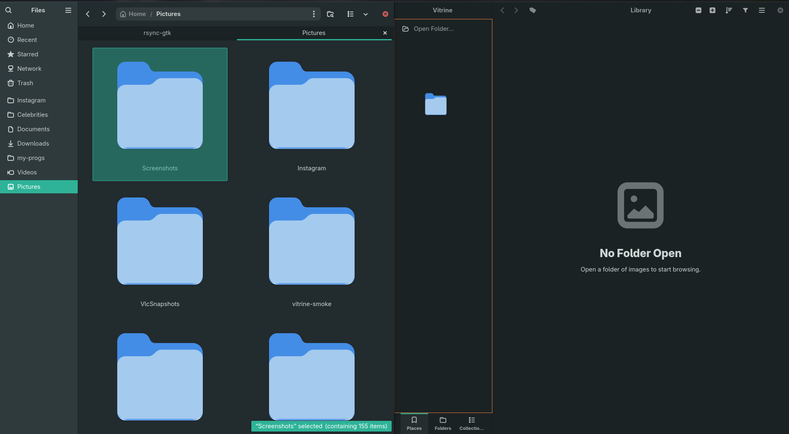
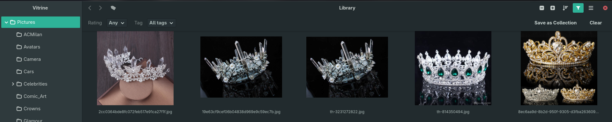
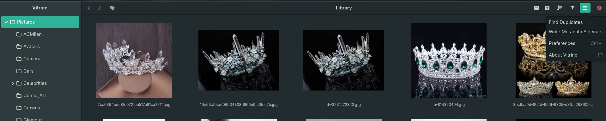

<p align="center">
  
</p>

<h1 align="center">Vitrine</h1>

<p align="center"><strong>Browse images that happen to be files — with a review layer that survives every rename.</strong></p>

<p align="center">
  
</p>

Vitrine is a fast, focused, **catalog-aware image browser + reviewer** for
GNOME: Loupe's viewer architecture + Nautilus's grid and selection model + a
catalog/tag layer keyed by content hash so ratings, tags, comments, and
collections survive gallery-dl renames and moves.

Rust · GTK4 · gtk-rs · libadwaita · Blueprint · glycin · SQLite · Flatpak.
See [`PLAN.md`](PLAN.md) for the phased build plan.

> **Status: v1 feature-complete.** Vitrine browses, views, indexes, reviews,
> organizes, edits (non-destructively), and de-duplicates — all keyed to survive
> renames. Builds via cargo,
> Meson, and flatpak-builder; the engine ships 83 tests and stays UI-free.
> Distributed as a Flatpak bundle via GitHub Releases, with the project page on
> [GitHub Pages](https://superuser-miguel.github.io/vitrine/) — **not** Flathub.

## Features

**Browse**
- Virtualized `GtkGridView` — rubber-band / Ctrl / Shift selection, adjustable
  thumbnail size (Ctrl +/−, Ctrl+scroll), trash-to-recycle. Bounded RAM + disk
  caches keep memory flat on 27k-image folders; reuses GNOME's shared thumbnail
  cache when it can.
- **First-class AVIF / JXL / HEIF** (plus JPEG/PNG/WebP/…) via glycin — color-
  managed, EXIF-oriented, decoded in sandboxed subprocesses.
- **Sidebar** — a gThumb-style switcher between **Places** (Nautilus-style
  bookmarks: rename, reorder by drag, remove; removable-media bookmarks show an
  **offline state** when the drive is disconnected), a lazy **Folders** tree, and
  **Collections**. Back / Forward navigation history.
- **Nautilus-style sorting** — Name / Size / Modified / Type with an independent
  ascending/descending toggle; instant, live, remembered across sessions.

**View**
- Single-image viewer — fit / zoom / pan / 100%, arrow-key navigation, a synced
  filmstrip, and a **properties sidebar** (dimensions, size, format, date taken,
  camera, orientation).

**Edit (non-destructive)**
- A **brush button** in the viewer opens an **edit card** (same slide-in as the
  properties panel) with **rotate**, **flip**, and **crop** — stored as
  instructions keyed by content hash and applied on decode, so **the original
  file is never rewritten**. **Undo / redo** per image.
- **Save / Save As** bakes the result to a flat file at full resolution when you
  want one (via the `image` crate, not a lossy re-encode of the original), and
  moves your ratings / tags / comments / collections to the baked copy's identity.

**Review & organize**
- **Ratings** (0–5 stars, keyboard in the grid, star overlays on thumbnails),
  **comments**, and **tags** (apply to a whole selection, autocomplete).
- **Collections** — hand-curated **catalogs** (drag images in, reorder) and
  **smart collections** (a saved filter that updates itself).
- **Filter bar** — narrow the grid live by minimum rating or tag; save the
  filter as a smart collection.

**Find duplicates**
- **Exact** (byte-identical) and **near** (perceptual-hash) clustering, with a
  reclaimable-space readout and one-click "trash the extras, keep the largest".

**Under the hood**
- A background, app-private **SQLite index** keyed by **BLAKE3 content hash**, so
  tags / ratings / comments / collections **survive gallery-dl renames and
  moves**. Move/delete reconciliation; background EXIF + perceptual-hash
  enrichment. Browsing never waits on the index.
- Portable **backup / export** of all annotations (JSON, content-hash keyed).
- **XMP sidecar export** — write `photo.jpg.xmp` sidecars (`xmp:Rating` /
  `dc:description` / `dc:subject`) for the selection so digiKam, darktable,
  Lightroom, and XnView read Vitrine's ratings, comments, and tags.
  Non-destructive: originals are never rewritten.
- **Preferences** for library roots and the thumbnail-cache budget.

## Screenshots

<table>
<tr>
<td width="50%"><br><em>The viewer — fit / zoom / pan / 100%, with a synced filmstrip.</em></td>
<td width="50%"><br><em>Review &amp; properties — stars, comments, and EXIF at a glance.</em></td>
</tr>
<tr>
<td width="50%"><br><em>Non-destructive edits — rotate / flip / crop, undone or baked at will.</em></td>
<td width="50%"><br><em>Drag a folder straight from Files into Places to bookmark it.</em></td>
</tr>
<tr>
<td width="50%"><br><em>Filter live by rating or tag — and save it as a smart collection.</em></td>
<td width="50%"><br><em>Find Duplicates and XMP sidecar export live in the primary menu.</em></td>
</tr>
</table>

## Roadmap

v1 is feature-complete. See [`PLAN.md`](PLAN.md) for full specs.

Recently shipped: a non-destructive edit tier (rotate / flip / crop), the
decode-scheduling performance sprint (viewport-ordered, cost-aware loading;
warm-cache-during-indexing), and a first cut of offline removable-media bookmarks.

**Next up**

- **Viewer: click-drag pan** — grab-hand panning for zoomed-in / large images;
  built once, needs a gesture-conflict fix (PLAN §14.1).
- **Deeper editing** — resize / straighten and GPU-accelerated adjustments, on top
  of the non-destructive rotate / flip / crop that ships today.

**Later**

- **Navigation** — a Nautilus-style address bar and tabs (Back/Forward shipped).
- **Lua scripting** — custom sort orders, batch ImageMagick ops, rename rules.
- **WASM compute plugins** — local auto-tagging and embedding-based "find
  similar", plus faces / OCR / quality scoring.
- **In-file XMP embed** — write the packet directly into JPEG/PNG containers, on
  top of the sidecar export that ships today.

## Install

**Not on Flathub** — Vitrine is distributed as a Flatpak **bundle via
[GitHub Releases](https://github.com/superuser-miguel/vitrine/releases)**, with
the project page on [GitHub Pages](https://superuser-miguel.github.io/vitrine/).

Download `Vitrine.flatpak` from the
[latest release](https://github.com/superuser-miguel/vitrine/releases/latest), then:

```sh
flatpak install --user ./Vitrine.flatpak
flatpak run io.github.superuser_miguel.Vitrine
```

The bundle references (does not include) the `org.gnome.Platform//50` runtime;
`flatpak install` fetches it from Flathub if you don't have it. Bundles don't
auto-update — grab a newer release and reinstall over it. Or build locally (below).

## Layout

```
crates/vitrine-engine/   UI-free core: index, hashing, scanning, dedup, queries
crates/vitrine-app/      GTK4/libadwaita shell (binary: `vitrine`)
data/                    Blueprint UI, gresource, desktop/metainfo, icon
build-aux/               Meson→cargo bridge + local checks
po/                      gettext catalogs
tests/fixtures/images/   Tiny generated sample images (see below)
```

`vitrine-engine` has **zero** GTK/GLib dependencies — enforced by
`build-aux/checks.sh` and CI.

## Build & run

### Host (fast dev iteration)

Requires `gtk4-devel`, `libadwaita-devel`, `blueprint-compiler`, and a Rust
toolchain.

```sh
# Plain cargo: build.rs compiles Blueprints + bundles the gresource into OUT_DIR.
cargo run -p vitrine-app

# Full checks (fmt, clippy, tests, engine-purity gate):
./build-aux/checks.sh
```

### Meson

```sh
meson setup builddir -Dprofile=development
meson compile -C builddir
meson test -C builddir          # desktop + metainfo validation
meson install -C builddir --destdir /tmp/vitrine-prefix
```

### Flatpak

```sh
flatpak-builder --user --install --force-clean build-dir \
  build-aux/io.github.superuser_miguel.Vitrine.yml
flatpak run io.github.superuser_miguel.Vitrine
```

That manifest allows build-time network for local iteration. The **release
bundle** published on GitHub Releases is built fully offline from the production
manifest (`build-aux/io.github.superuser_miguel.Vitrine.release.yml`), which
pins the release tag and vendors the crate graph
(`build-aux/cargo-sources.json`, regenerated from `Cargo.lock` with
flatpak-builder-tools' `flatpak-cargo-generator.py` whenever the lockfile
changes):

```sh
flatpak-builder --user --force-clean --repo=repo-release build-dir-release \
  build-aux/io.github.superuser_miguel.Vitrine.release.yml
flatpak build-bundle repo-release Vitrine.flatpak io.github.superuser_miguel.Vitrine \
  --runtime-repo=https://flathub.org/repo/flathub.flatpakrepo
```

## Test fixtures

`tests/fixtures/images/` holds tiny generated sample images used by engine
tests. Regenerate with:

```sh
python3 tests/fixtures/generate.py
```
