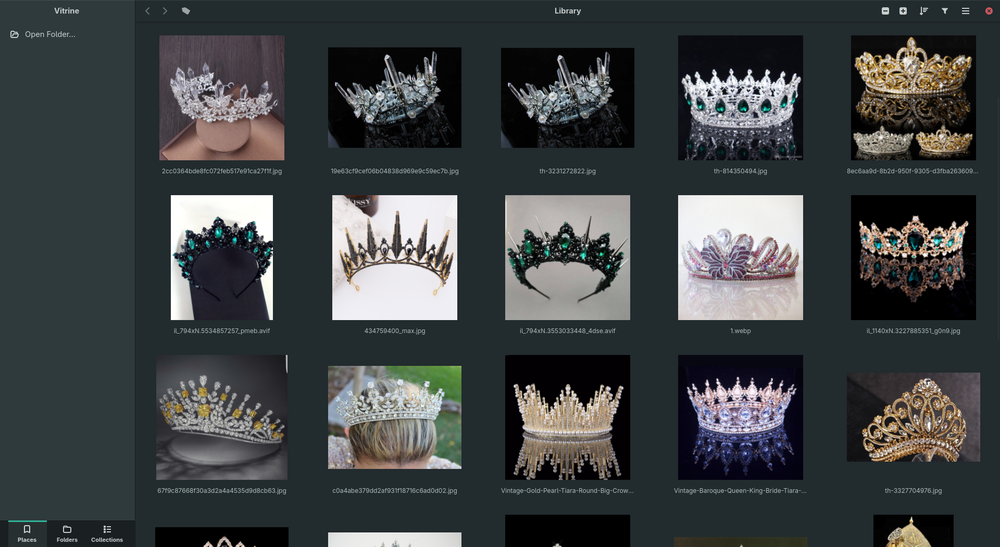
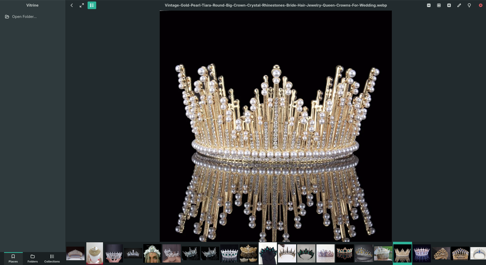
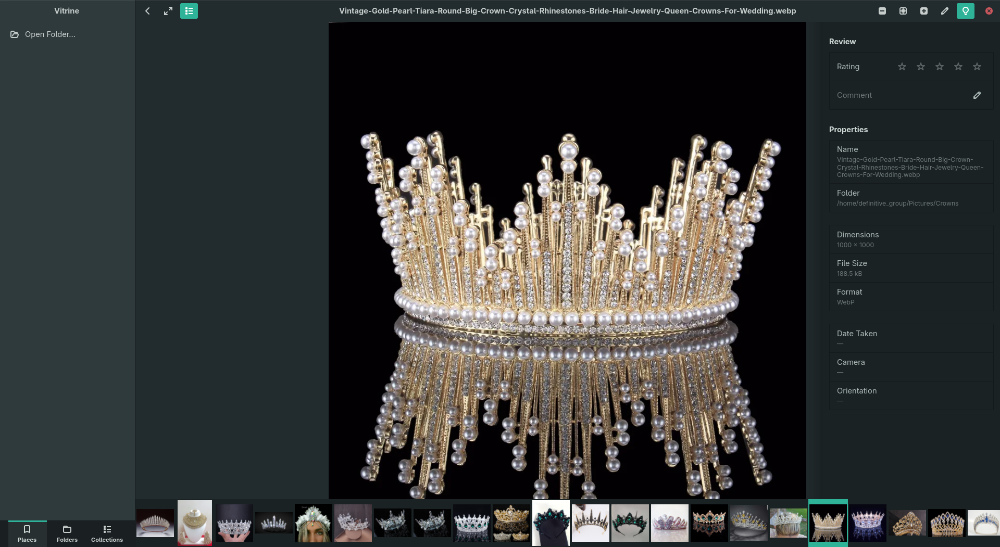
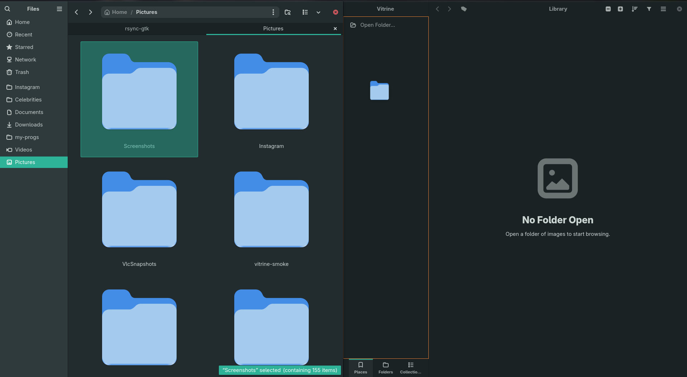
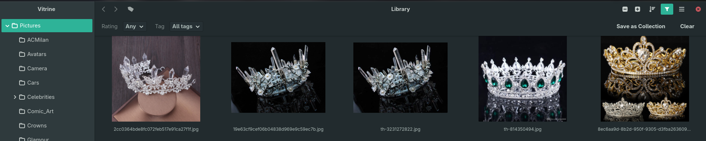
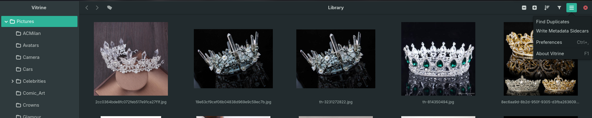

<p align="center">
  
</p>

<h1 align="center">Vitrine</h1>

<p align="center"><strong>Browse images that happen to be files — with a review layer that survives every rename.</strong></p>

<p align="center">
  
</p>

Vitrine is a fast, focused, **catalog-aware image browser + reviewer** for
GNOME: Loupe's viewer architecture + Nautilus's grid and selection model + a
catalog/tag layer keyed by content hash so ratings, tags, comments, and
collections survive gallery-dl renames and moves.

Rust · GTK4 · gtk-rs · libadwaita · Blueprint · glycin · SQLite · Flatpak.
See [`PLAN.md`](PLAN.md) for the phased build plan.

> **Status: v0.3.0.** Vitrine browses, views, indexes, reviews, organizes,
> edits (non-destructively), and de-duplicates — all keyed to survive renames.
> Builds via cargo, Meson, and flatpak-builder; the engine stays UI-free.
> Distributed from its own **signed Flatpak repo** (see [Install](#install)),
> with the project page on
> [GitHub Pages](https://superuser-miguel.github.io/vitrine/) — **not** Flathub.

## What's new in 0.3.0

- **Find by name** — press `Ctrl+F` or `/` and type: the grid narrows to fuzzy
  matches on file name and path, best match first ("snst" finds `sunset.jpg`).
- **Histogram** — luminance and RGB in the viewer's Image Properties panel.
- **Thumbnails for USB and network drives are kept between sessions**, and
  recognised by content, so they're reused even when the drive mounts somewhere
  else.
- **Sort orders as Lua scripts** — they appear under *From Scripts* in the Sort
  By menu and re-sort the grid as you save. Starter scripts in
  [`docs/scripts/`](docs/scripts/).
- **Remove a tag from a whole selection** — an Add / Remove toggle in the grid's
  Tag popover.
- **Fixed:** the window tiles to half the screen again; thumbnails no longer stay
  blank after a fast scroll; large folders decode what's on screen first; the
  grid stops competing with the viewer while an image is open; very large images
  no longer freeze the app while they're indexed.
- **Automatic updates** — the first release on Vitrine's own signed update
  channel. Coming from 0.1.0 or 0.2.0? See
  [Moving from a bundle install](#moving-from-a-bundle-install-010-or-020).

## Features

**Browse**
- Virtualized `GtkGridView` — rubber-band / Ctrl / Shift selection, adjustable
  thumbnail size (Ctrl +/−, Ctrl+scroll), trash-to-recycle. Bounded RAM + disk
  caches keep memory flat on 27k-image folders; reuses GNOME's shared thumbnail
  cache when it can, and keeps a separate, persistent thumbnail cache for USB and
  network drives that's reused across mounts by content.
- **First-class AVIF / JXL / HEIF** (plus JPEG/PNG/WebP/…) via glycin — color-
  managed, EXIF-oriented, decoded in sandboxed subprocesses.
- **Sidebar** — a gThumb-style switcher between **Places** (Nautilus-style
  bookmarks: rename, reorder by drag, remove; removable-media bookmarks show an
  **offline state** when the drive is disconnected), a lazy **Folders** tree, and
  **Collections**. Back / Forward navigation history.
- **Nautilus-style sorting** — Name / Size / Modified / Type / Rating / Date
  Taken with an independent ascending/descending toggle; instant, live,
  remembered across sessions.
- **Script sort orders** — any order you can write as a few lines of Lua, picked
  from the Sort By menu and hot-reloaded as you edit. Drop scripts into
  `~/.var/app/io.github.superuser_miguel.Vitrine/data/vitrine/scripts/`; see
  [`docs/scripts/`](docs/scripts/) for five starters.

**View**
- Single-image viewer — fit / zoom / pan / 100%, arrow-key navigation, a synced
  filmstrip, and a **properties sidebar** (dimensions, size, format, date taken,
  camera, orientation) with an optional **histogram** (luminance + RGB).

**Edit (non-destructive)**
- A **brush button** in the viewer opens an **edit card** (same slide-in as the
  properties panel) with **rotate**, **flip**, and **crop** — stored as
  instructions keyed by content hash and applied on decode, so **the original
  file is never rewritten**. **Undo / redo** per image.
- **Save / Save As** bakes the result to a flat file at full resolution when you
  want one (via the `image` crate, not a lossy re-encode of the original), and
  moves your ratings / tags / comments / collections to the baked copy's identity.

**Review & organize**
- **Ratings** (0–5 stars, keyboard in the grid, star overlays on thumbnails),
  **comments**, and **tags** (add to or remove from a whole selection,
  autocomplete).
- **Collections** — hand-curated **catalogs** (drag images in, reorder) and
  **smart collections** (a saved filter that updates itself).
- **Filter bar** — narrow the grid live by minimum rating or tag, and **fuzzy
  find** by name and path (`Ctrl+F` or `/`); save the rating/tag filter as a
  smart collection.

**Find duplicates**
- **Exact** (byte-identical) and **near** (perceptual-hash) clustering, with a
  reclaimable-space readout and one-click "trash the extras, keep the largest".

**Under the hood**
- A background, app-private **SQLite index** keyed by **BLAKE3 content hash**, so
  tags / ratings / comments / collections **survive gallery-dl renames and
  moves**. Move/delete reconciliation; background EXIF + perceptual-hash
  enrichment. Browsing never waits on the index.
- Portable **backup / export** of all annotations (JSON, content-hash keyed).
- **XMP sidecar export** — write `photo.jpg.xmp` sidecars (`xmp:Rating` /
  `dc:description` / `dc:subject`) for the selection so digiKam, darktable,
  Lightroom, and XnView read Vitrine's ratings, comments, and tags.
  Non-destructive: originals are never rewritten.
- **Preferences** for library roots and the thumbnail-cache budget.

## Screenshots

<table>
<tr>
<td width="50%"><br><em>The viewer — fit / zoom / pan / 100%, with a synced filmstrip.</em></td>
<td width="50%"><br><em>Review &amp; properties — stars, comments, and EXIF at a glance.</em></td>
</tr>
<tr>
<td width="50%"><br><em>Non-destructive edits — rotate / flip / crop, undone or baked at will.</em></td>
<td width="50%"><br><em>Drag a folder straight from Files into Places to bookmark it.</em></td>
</tr>
<tr>
<td width="50%"><br><em>Filter live by rating or tag — and save it as a smart collection.</em></td>
<td width="50%"><br><em>Find Duplicates and XMP sidecar export live in the primary menu.</em></td>
</tr>
</table>

## Roadmap

See [`PLAN.md`](PLAN.md) for full specs, and the
[blog](https://superuser-miguel.github.io/vitrine/blog/) for the stories behind
the hard parts.

Recently shipped (0.3.0): fuzzy find, the histogram, the persistent removable /
network thumbnail cache, Lua sort scripts, bulk tag removal, and the signed
update channel.

**Next up**

- **Viewer: click-drag pan** — grab-hand panning for zoomed-in / large images;
  built once, needs a gesture-conflict fix (PLAN §14.1).
- **Deeper editing** — resize / straighten and GPU-accelerated adjustments, on top
  of the non-destructive rotate / flip / crop that ships today.

**Later**

- **Navigation** — a Nautilus-style address bar and tabs (Back/Forward shipped).
- **More scripting** — batch ImageMagick operations and rename rules, on top of
  the sort scripts that ship today.
- **WASM compute plugins** — local auto-tagging and embedding-based "find
  similar", plus faces / OCR / quality scoring.
- **In-file XMP embed** — write the packet directly into JPEG/PNG containers, on
  top of the sidecar export that ships today.

## Install

**Not on Flathub** — Vitrine ships from its own **signed Flatpak repository**,
with the project page on [GitHub Pages](https://superuser-miguel.github.io/vitrine/).

### Recommended — the repository (gets `flatpak update`)

```sh
flatpak install --user https://superuser-miguel.github.io/vitrine-repo/vitrine.flatpakref
flatpak run io.github.superuser_miguel.Vitrine
```

That one command (or opening
[`vitrine.flatpakref`](https://superuser-miguel.github.io/vitrine-repo/vitrine.flatpakref)
in GNOME Software) adds the remote and installs the app, so new versions arrive
with a normal `flatpak update`. The remote is GPG-signed; flatpak verifies every
pull against the key embedded in the `.flatpakref`.

### Alternative — the standalone bundle

A `Vitrine.flatpak` bundle is also published on
[GitHub Releases](https://github.com/superuser-miguel/vitrine/releases/latest)
for offline or air-gapped installs:

```sh
flatpak install --user ./Vitrine.flatpak
```

> A bundle install has **no origin to pull from**, so `flatpak update` cannot
> upgrade it — moving versions means downloading the next bundle by hand. Prefer
> the repository unless you specifically need a single offline file.

Either way you need the GNOME 50 runtime; `flatpak install` fetches
`org.gnome.Platform//50` from Flathub if you don't have it.

### Moving from a bundle install (0.1.0 or 0.2.0)

Vitrine 0.1.0 and 0.2.0 were published only as bundles, so those installs will
never update on their own. Switch to the repository once:

```sh
flatpak uninstall --user io.github.superuser_miguel.Vitrine
flatpak install --user https://superuser-miguel.github.io/vitrine-repo/vitrine.flatpakref
```

Your index, tags, ratings, comments, collections, bookmarks, scripts and
settings are kept: they live in `~/.var/app/io.github.superuser_miguel.Vitrine/`,
which a plain `flatpak uninstall` leaves alone (don't add `--delete-data`).
After that, `flatpak update` keeps you current.

## Layout

```
crates/vitrine-engine/   UI-free core: index, hashing, scanning, dedup, queries
crates/vitrine-app/      GTK4/libadwaita shell (binary: `vitrine`)
data/                    Blueprint UI, gresource, desktop/metainfo, icon
build-aux/               Meson→cargo bridge + local checks
po/                      gettext catalogs
tests/fixtures/images/   Tiny generated sample images (see below)
```

`vitrine-engine` has **zero** GTK/GLib dependencies — enforced by
`build-aux/checks.sh` and CI.

## Build & run

### Host (fast dev iteration)

Requires `gtk4-devel`, `libadwaita-devel`, `blueprint-compiler`, and a Rust
toolchain.

```sh
# Plain cargo: build.rs compiles Blueprints + bundles the gresource into OUT_DIR.
cargo run -p vitrine-app

# Full checks (fmt, clippy, tests, engine-purity gate):
./build-aux/checks.sh
```

### Meson

```sh
meson setup builddir -Dprofile=development
meson compile -C builddir
meson test -C builddir          # desktop + metainfo validation
meson install -C builddir --destdir /tmp/vitrine-prefix
```

### Flatpak

```sh
flatpak-builder --user --install --force-clean build-dir \
  build-aux/io.github.superuser_miguel.Vitrine.yml
flatpak run io.github.superuser_miguel.Vitrine
```

That manifest allows build-time network for local iteration. The **release
bundle** published on GitHub Releases is built fully offline from the production
manifest (`build-aux/io.github.superuser_miguel.Vitrine.release.yml`), which
pins the release tag and vendors the crate graph
(`build-aux/cargo-sources.json`, regenerated from `Cargo.lock` with
flatpak-builder-tools' `flatpak-cargo-generator.py` whenever the lockfile
changes):

```sh
flatpak-builder --user --force-clean --repo=repo-release build-dir-release \
  build-aux/io.github.superuser_miguel.Vitrine.release.yml
flatpak build-bundle repo-release Vitrine.flatpak io.github.superuser_miguel.Vitrine \
  --runtime-repo=https://flathub.org/repo/flathub.flatpakrepo
```

## Test fixtures

`tests/fixtures/images/` holds tiny generated sample images used by engine
tests. Regenerate with:

```sh
python3 tests/fixtures/generate.py
```
